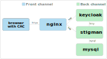

# STIG Manager with CAC Authentication

## Limitations of this example

This is an example orchestration for deploying STIG Manager with support for user authentication incorporating a username and password. **The example supports connections to a shared application and is intendend for production use.  **

## General architecture



- `nginx` executes a TLS stack with client certificate verification and listens on a front channel HTTPS port.
- `nginx` proxies traffic to `stigman` and `keycloak` which are listening on back channel HTTP ports.
- `stigman` communicates with `keycloak` and `mysql` using their back channel ports.
- `user browser` connects to `nginx` on the front channel HTTPS port and requests resources from `stigman` and `keycloak`.

This general architecture can be implemented with a wide range of technologies, from bare-metal deployments to complex containerized orchestrations. The example uses a simple docker-compose orchestration. 

## Requirements for running the example

- Recent Windows, Linux, or macOS
- Username and Password configured in Keycloak
- docker
- docker-compose
- Chrome, Edge, or Firefox browser
- Internal Certificate Authority
- DNS CNAME entry pointing to stigman on the docker host 

This example uses a server certificate issued to the host `stigman` and signed by your internal CA`. For the example to work, you must have a working internal certificate authority).


## Fetching the example files

You have two options:

- If you have `git` installed, clone this repository. Then change to the newly created directory.

- Download a ZIP of this repository using the green Code button above. Extract the archive to an appropriate directory and change to the newly extracted directory.
## Starting the orchestration

```
docker-compose up
```

The orchestration's container images will be downloaded if they are not already available on your system. How long this takes depends on your connection speed and registry performance. Once all container images are available, the orchestration will start.

The orchestration has successfully bootstrapped when you see a `started` message like this from the STIG Manager API:

```
{"date":"2022-10-01T18:04:26.734Z","level":3,"component":"index","type":"started","data":{"durationS":21.180474449,"port":54000,"api":"/api","client":"/","documentation":"/docs"}}
```

## Authenticating to STIG Manager with Username and Password

Once STIG Manager has started, navigate your browser to:

```
https://your_dns_hostname/stigman/
```

- You will be redircted to Keycloak
- Sign into keycloak with your username and password.

You can access the Keycloak admin pages by navigating to:

```
https://your_dns_hostname/kc/admin
```

Login with the credentials `admin/Pa55w0rd`
- Setup new user accounts by going to the stigman realm and creating the users there.
- Use the Details tab to modify users
- Use the credentials tab to set the user's password
- Use the role mapping tab to set roles as required for your org.
- Have your user sign in after creating accounts


## Ending the orchestration

Type `Ctrl-C` to end the orchestration, followed by:

```
docker-compose down
```

> After using Chrome to HTTPS connect to `https://localhost`, you may find Chrome will no longer make HTTP connections to `http://localhost:[ANY_PORT]`. Once you're finished with the example, see [this note](#to-clear-chrome-hsts-entry-for-localhost-perhaps) for how to remedy this.

## Configurations

### Nginx

Nginx requires a PEM file containing certificates for the DoD Root CA and Intermediate CAs used to sign CAC certificates. 

> The example provides the file `certs/dod/Certificates_PKCS7_v5.9_DoD.pem.pem` for this purpose, which is mounted to the Nginx container at `/etc/nginx/dod-certs.pem`

You can [review the file `nginx/nginx.conf`](nginx/nginx.conf).

### STIG Manager

The environment variables `STIGMAN_OIDC_PROVIDER` and `STIGMAN_CLIENT_OIDC_PROVIDER` are set to the Keycloak back channel and front channel realm URLs, respectively.

### Keycloak

[The Keycloak Guides](https://www.keycloak.org/guides) provide documentation on configuring Keycloak for many deployment scenarios including this example orchestration. 
#### Keycloak Authentication Flow

WIP


#### Keycloak keystores

Keycloak behind Nginx requires a keystore that contains certificates for the Root CA and Intermediate CAs used to sign certificates. 

> If you have your own CA you will need to generate a pem.p12 certificate for this purpose, which is mounted to the Keycloak container at `/tmp/truststore.p12`


## Notes
### To clear Chrome HSTS entry (for localhost, perhaps)

`chrome://net-internals/#hsts` -  Delete domain security policies

`chrome://settings/clearBrowserData` - Cached images and files


